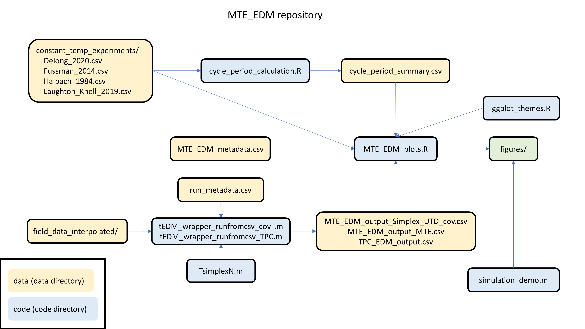

# Integration of Metabolic Theory of Ecology and Empirical Dynamic Modeling (MTE-EDM)

<!-- badges: start -->
<!-- badges: end -->

This repository contains the data and code associated with the paper "Constraining nonlinear time series modeling with the metabolic theory of ecology" by Stephan Munch, Tanya Rogers, Celia Symons, David Anderson, and Frank Pennekamp.

Field data files are located in `data/field_data_interpolated/`. Time is in units of decimal years, temperature in degrees C. See `data/MTE_EDM_metadata.csv` for the species information corresponding to each file. To comply with data licensing polices, the Lake Geneva data are omitted. The file `run_metadata_public.csv` can be substituted for `run_metadata.csv` to run the model-fitting code without these series. Data sources are listed in Table S2 of the publication.